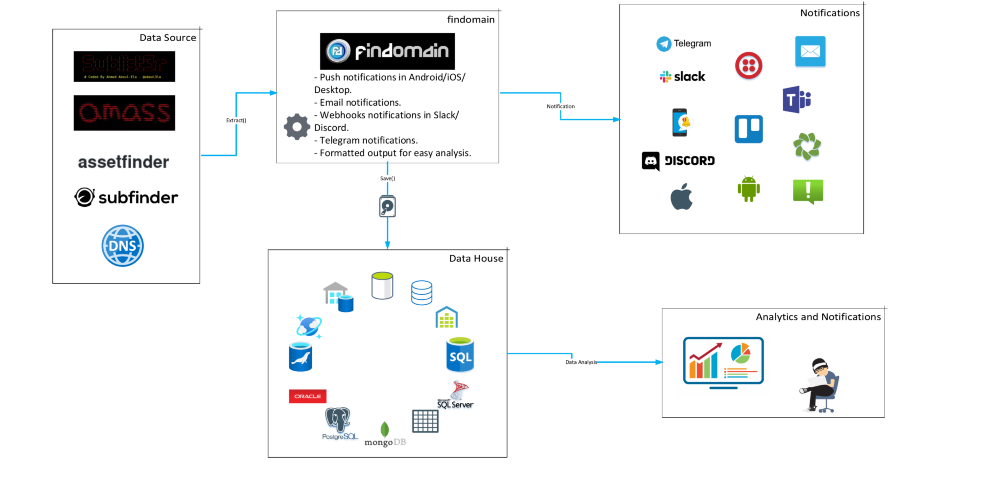

[](https://twitter.com/edu4rdshl)
[](https://twitter.com/FindomainApp)

[](https://crates.io/crates/findomain)
[](https://travis-ci.org/edu4rdshl/findomain)
[](https://ci.appveyor.com/project/edu4rdshl/findomain)
[](https://github.com/Edu4rdSHL/findomain/actions)

# Findomain Monitoring Service

If you don't want to deal with servers and complex configurations for doing recon, Findomain offers [a dedicated monitoring service hosted in Amazon](https://findomain.app/#Pricing), that allow you to **monitor your target domains with multiple top tools** (OWASP Amass, Sublist3r, Assetfinder and Subfinder) and send alerts to Discord, Slack, Telegram, Email or Push Notifications (Android/iOS/Smart Watch/Desktop) when new subdomains are found. **The only you need to do is configure a file with your email address (if applicable) or/and webhooks/Telegram chat information and put your domains in another file**, once you have done that you have a full automated subdomains monitoring service that keep you up to date with new subdomains discovered, Host IP, HTTP Status, Screenshots of the HTTP websites, Open Ports, Subdomains CNAME and more. All your data is securely saved in a relational database and you can request a dump of your data whenever you want.

When you finish your paypment, you will receive an email with the server credentials and documentation about how to fill the configuration file and other details.

## Pricing

[**See available plans here.**](https://findomain.app/#Pricing)

## Monitoring Methodology

Learn more about the monitoring server following [this link](https://findomain.app/findomain-advanced-automated-and-modern-recon/).



**Demos:**

[](https://asciinema.org/a/3kHnCYTDsOp20ttgNXXgvCRjX)

**Screenshots:**


# Findomain


The fastest and cross-platform subdomain enumerator.

## Chat with us

[](https://discord.gg/y5JaRbX)

The next table offers you the comparison about what is in Plus version that is not in free version (current repo).

## Plus Features

**Implemented features:**
| Feature  | Plus Version Support | Free Version Support |
| ------------- | ------------- | ------------- |
| [Core features](README.md#features)  | Yes  |Yes|
| Check subdomains HTTP/S status | Yes  |No|
| Check subdomains open ports | Yes  |No|
| Track CNAME for subdomains | Yes | No |
| Support for posting HOST, IP, HTTP status and open ports to webhook notifications | Yes  |No|
| Support for "light monitoring" mode | Yes  |No|
| Support for automatic detection/read of default configuration file | Yes  |No|
| Save Host, IP, HTTP Status and Open Ports to database  | Yes  |No|
| Option to exclude sources | Yes  |No|
| Filter or exclude subdomains containing specific keywords. | Yes  |No|
| Maximum number of threads 1000 | Yes  |No|
| Force all targets to be lowercase | Yes  |No|
| Port scanner  | Yes  |No|
| Save root domain to database  | Yes  |No|
| Custom user agent configuration | Yes |No |
| Rate limit user configuration | Yes | No |
| Output files written in real-time | Yes | No|
| Output to unique file while monitoring | Yes | No|
| Option to save subdomains data to database without setting up monitoring | Yes | No |
| Option to save data in your database if the webhook timeout | Yes | No |
| Built-in top faster DNS IP addresses | Yes | No |
| Subdomains screenshots of HTTP server support (requires Chrome/Chromium to run in headless mode) | Yes | No |
| Use job names to identify targets (see [this tweet](https://twitter.com/Edu4rdSHL/status/1250847891238854656)) | Yes | No |
| Update the existing data in the database | Yes | No |
| Email notifications.  | Yes  |No|
| Push notifications through [Pushover](https://pushover.net). | Yes  |No|
| Track CNAME for subdomains | Yes | No |

**Planned features:**
| Feature  | Plus Version Plans | Free Version Plans |
| ------------- | ------------- | ------------- |
| [Project Sonar](https://www.rapid7.com/research/project-sonar/) integration | Yes  |No|
| Shodan source support  | Yes  |No|
| Elastic search support  | Yes  |No|
| SQLite output  | Yes  |No|

# What Findomain can do?

It table gives you a idea why you should use findomain and what it can do for you. The domain used for the test was aol.com in the following [BlackArch](https://blackarch.org) virtual machine:

```
Host: KVM/QEMU (Standard PC (i440FX + PIIX, 1996) pc-i440fx-3.1)
Kernel: 5.2.6-arch1-1-ARCH
CPU: Intel (Skylake, IBRS) (4) @ 2.904GHz
Memory: 139MiB / 3943MiB
```
The tool used to calculate the time, is the `time` command in Linux.

|Enumeration Tool|Search Time|Total Subdomains Found|CPU Usage|RAM Usage|
|---|---|---|---|---|
|Findomain|real 0m5.515s|84110|Very Low|Very Low|

**Summary:** 84110 subdomains in 5.5 seconds.

# Features

* Subdomains monitoring: put data to Discord, Slack or Telegram webhooks.  See [Subdomains Monitoring](README.md#subdomains-monitoring) for more information.
* Multi-thread support for API querying, it makes that the maximun time that Findomain will take to search subdomains for any target is 15 seconds (in case of API's timeout).
* Parallel support for subdomains resolution, in good network conditions can resolv about 3.5k of subdomains per minute.
* DNS over TLS support.
* Specific IPv4 or IPv6 query support.
* Discover subdomains without brute-force, it tool uses Certificate Transparency Logs and APIs.
* Discover only resolved subdomains.
* Discover subdomains IP for data analisis.
* Read target from user argument (-t) or file (-f).
* Write to one unique output file specified by the user all or only resolved subdomains.
* Write results to automatically named TXT output file(s).
* Hability to query directly the Findomain database created with [Subdomains Monitoring](README.md#subdomains-monitoring) for previous discovered subdomains.
* Hability to import and work data discovered by other tools.
* Quiet mode to run it silently.
* Cross platform support: Any platform, it's written in Rust and Rust is multiplatform. See [the documentation](README.md#build-for-32-bits-or-another-platform) for instructions.
* Multiple API support.
* Possibility to use as subdomain resolver.
* Subdomain wildcard detection for accurate results. 
* Support for subdomain discover using bruteforce method.
* Support for configuration file in TOML, JSON, HJSON, INI or YAML format.
* Custom DNS IP addresses for fast subdomains resolving (more than 60 per second by default, adjustable using the `--threads` option.

# Findomain in depth

See [Subdomains Enumeration: what is, how to do it, monitoring automation using webhooks and centralizing your findings](https://medium.com/@edu4rdshl/subdomains-enumeration-what-is-how-to-do-it-monitoring-automation-using-webhooks-and-5e0a0c6d9127) for a detailed guide including real world examples of how you get the most out of the tool.

# How it works?
It tool doesn't use the common methods for sub(domains) discover, the tool uses Certificate Transparency logs and specific well tested APIs to find subdomains. It method make it tool the most faster and reliable. The tool make use of multiple public available APIs to perform the search. If you want to know more about Certificate Transparency logs, read https://www.certificate-transparency.org/

APIs that we are using at the moment:

- [Certspotter](https://api.certspotter.com/)
- [Crt.sh Database (favorite) or Crt.sh HTTP API](https://crt.sh)
- [Virustotal](https://www.virustotal.com/ui/domains/)
- [Sublist3r](https://api.sublist3r.com/)
- [Facebook](https://developers.facebook.com/docs/certificate-transparency) `**`
- [Spyse (CertDB)](https://certdb.com/apidocs#/Subdomains) `*`
- [Bufferover](http://dns.bufferover.run/)
- [Threatcrowd](https://threatcrowd.org/)
- [Virustotal with apikey](https://www.virustotal.com/) `**`
- [AnubisDB](https://jonlu.ca/anubis/)
- [Urlscan.io](https://urlscan.io/about-api/)
- [SecurityTrails](https://docs.securitytrails.com/docs) `**`
- [Threatminer](https://www.threatminer.org/api.php)

**Notes**

APIs marked with `**`, **require** an access token to work. Search in the [Findomain documentation](README.md#access-tokens-configuration) how to configure and use it.

APIs marked with `*` can *optionally* be used with an access token, create one if you start experiencing problems with that APIs. Search in the [Findomain documentation](README.md#access-tokens-configuration) how to configure and use it.

**More APIs?**

If you know other APIs that should be added, comment [here](https://github.com/Edu4rdSHL/findomain/issues/7).

# Development

In order to make sure Findomain will not be broken on some commit I have created the [develop branch](https://github.com/Edu4rdSHL/findomain/tree/develop) where new features and improvements are pushed before they go to [master branch](https://github.com/Edu4rdSHL/findomain/tree/master). In resume the difference is: **develop branch and beta releases aren't ready for production purposes but testing or development purposes** and **master branch and non-beta releases are ready for production purposes**. If you are a developer or want to be a beta tester of the new features that are added to Findomain then use the develop branch, otherwise always use the master branch. Every new feature is tested before it goes to master by the Findomain beta testers that are only ([@sumgr0](https://github.com/sumgr0)) at the moment, I will appreciate if you join to the testing process, just send me a DM in Twitter ([@edu4rdshl](https://twitter.com/edu4rdshl)).

**If you are a packager of Findomain for X system distribution always go for the master branch if using git or non-beta releases if using releases model**.

**Build the development version:**

You need to have [rust](https://rust-lang.org), [make](http://www.gnu.org/software/make) and [perl](https://www.perl.org/) installed in your system first.

```bash
$ git clone https://github.com/Edu4rdSHL/findomain.git -b develop # Only the develop branch is needed
$ cd findomain
$ cargo build --release
$ ./target/release/findomain
```
To update the repository when new commits are added, just go to the folder where Findomain's develop branch was cloned and excute:

```
$ git pull
$ cargo build --release
$ ./target/release/findomain
```

# Installation

We offer binarys ready to use for the following platforms (all are for 64 bits only):

* [Linux](docs/INSTALLATION.md#installation-in-linux-using-compiled-artifacts)
* [Windows](docs/INSTALLATION.md#installation-windows)
* [MacOS](docs/INSTALLATION.md#installation-macos)
* [Aarch64 (Raspberry Pi)](docs/INSTALLATION.md#installation-aarch64-raspberry-pi)
* [NixOS](docs/INSTALLATION.md#installation-nixos)
* [Docker](docs/INSTALLATION.md#installation-docker)

If you need to run Findomain in another platform, continue reading the documentation.


# Issues and requests

If you have a problem or a feature request, open an [issue](https://github.com/Edu4rdSHL/findomain/issues).

# Stargazers over time

[](https://starchart.cc/Edu4rdSHL/findomain)

## Contributors

### Code Contributors

This project exists thanks to all the people who contribute. [See the contributors list](https://github.com/Edu4rdSHL/findomain/graphs/contributors).
