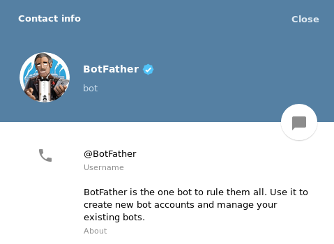
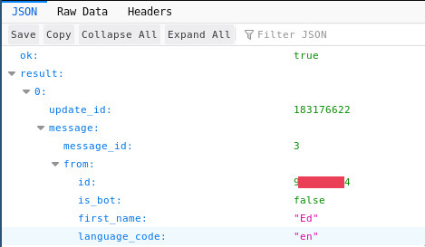

# Requisites

[Telegram messenger](https://telegram.org/): Download the app to the phone or desktop as well.

# Configuration

Search the BotFather, the official bot that allows you to create bots.

Then, create a new bot:

`/newbot`

Choose a name for your bot

`FindomainBot`

Choose a username for your bot, which must end with "_bot"

`FindomainWebhook_bot`

Once the bot is created, you will have a long string that is the TOKENID. The message will be similar to:

`Use this token to access the HTTP API:`

It will be used as the `telegram_bot_token` variable in the config file, save it.

Now, the bot is only the "guy" who will send you the messages. It has to know the chat where to send them. For this reason, got to the search bar of Telegram, and search your bot. Then, start the bot:

`/start` and send a message to your bot.

You can now go to the website https://api.telegram.org/bot[BOT_TOKEN]/getUpdates (replacing [BOT_TOKEN] with the token you received before) and search for your id.

It will be used as the `telegram_chat_id` variable in the configuration file, save it.

Now you are ready to use the Telegram webhook.

For configuration file examples, see [this link](https://github.com/Edu4rdSHL/findomain/tree/master/config_examples).
